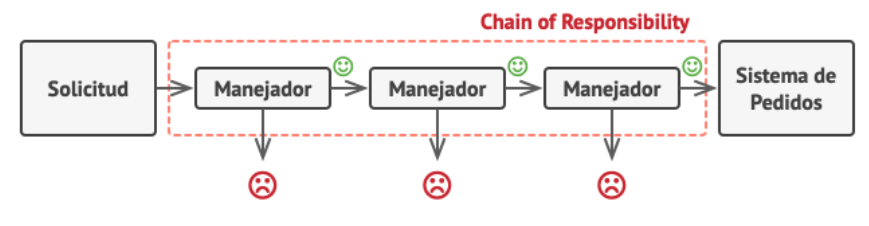

[English version](README_en.md)

# Router Design Pattern

Este repositorio plantea ejemplos de como usar efectivamente el patrón de diseño Router en los framework REST.

## Router Design Pattern

Este patrón de diseño surge de lenguajes funcionales, muchos los frameworks modernos lo adoptan, como express, gin, etc.

El concepto es muy simple, definimos una ruta y llamamos a los handlers que queremos que se ejecuten.

```go
func init() {
	getRouter().GET("/ping", pingHandler)
}
```

En su forma mas simple, es una ruta y un handler.

## Chain Of Responsibility

Pero el concepto de Route pattern va mas allá, para comprenderlo, necesitamos conocer un poco mas del patrón Chain of Responsibility (CoR).

- Es un concepto viejo de programación funcional
- Permite reutilizar código
- Separa mejor las responsabilidades en funciones simples
- Permite hacer las responsabilidades de controller de forma muy simplificada
- Permite armar una respuesta compleja en forma ordenada y por etapas



Como podemos ver, la idea es descomponer una rutina grande en funciones que realicen una sola actividad, y continúen o bloqueen el proceso de ser necesario.

## Volviendo al Router Design Pattern

El router pattern está basado en CoR pattern.

Existen 2 conceptos middlewares y handlers

En todos los casos tenemos la opción de controlar completamente el control del request.

### Middlewares

En general se les llama los handlers, y actúan sobre todas las rutas y se definen a nivel servidor.

Es muy util para realizar operaciones como :

- Seguridad : Autorización y Autenticación
- Carga de recursos i18n
- Manejo de errores
- Validar CORS
- Validar seguridad de empaquetado y estructuras
- Prevenir Hacks
- Manejo de contextos de transacciones
- Precarga de recursos relacionados al request
- Loggers de estadisticas

Y muchas otras cosas mas.

En este repositorio, podemos encontrar un ejemplo en middlewares/errors.go

En la ruta lo configuramos en la configuración global del servidor:

```go
router = gin.Default()
router.Use(middlewares.ErrorHandler)
```

Y la implementación :

```go
// ErrorHandler a middleware to handle errors
func ErrorHandler(c *gin.Context) {
	c.Next()

	handleErrorIfNeeded(c)
}

func handleErrorIfNeeded(c *gin.Context) {
	err := c.Errors.Last()
  ...
```

Este handler llama primero a c.Next, que corresponde a la llamada del siguiente elemento en la cadena de responsabilidades, una vez ejecutado el código, se analizara si se obtuvo una respuesta a través de un error, en cuyo caso se enviara al cliente una respuesta acorde al error obtenido.

En otras implementaciones podríamos bloquear la llamada a Next de ser necesario y responder con algún error puntual.

### Handlers de ruta

El funcionamiento es el mismo que el de middleware, solo que aplican a una ruta en particular.

Son muy útiles para

- Validar requests
- Validar autorización a recursos
- Validar estructuras de datos
- Precarga de datos relacionados

En general son la herramienta mas importante para producir un early exit o guard clause.

Con ellos podemos cortar la cadena de responsabilidades forzando errores, de una manera muy sencilla y puntual.

Permite desacoplar todo el manejo del controller en funciones simples, fáciles de testear, de leer, y mantener.

Ademas nos permite reutilizar funciones, ya que los handlers son funciones, y al tener una sola responsabilidad es común que podamos reutilizarlas. Por ejemplo para validar algún parámetro de url que utilicemos en varias rutas.

Como vemos en el ejemplo get_hello_username.go

```go
// Internal configure ping/pong service
func init() {
	getRouter().GET(
		"/hello/:userName",
		validateUserName,
		sayHelloHandler,
	)
}

// validamos que el parámetro userName tenga al menos 5 caracteres
func validateUserName(c *gin.Context) {
	userName := c.Param("userName")

	if len(userName) < 5 {
		c.Error(errors.NewCustomError(400, "userName debe tener al menos 5 caracteres"))
		c.Abort()
		return
	}
}
```

La función validateUserName se define como un middleware de ruta, y valida el parámetro de url para que sea correcto, en caso de error aborta la cadena de responsabilidades. Este patrón se le llama early exit o guard clause.

Una vez realizadas todas las validaciones, el código del handler es muy simple y muy fácil de leer, porque a estas alturas nos aseguramos que todo este correcto para ejecutarlo.

```go
func sayHelloHandler(c *gin.Context) {
	userName := c.Param("userName")

	c.JSON(http.StatusOK, gin.H{
		"answer": service.SayHello(userName),
	})
}
```

Los tests son mucho mas sencillos, porque testeamos función por función en forma individual, por ejemplo :

```go
func TestValidateUserName(t *testing.T) {
	response := test.ResponseWriter(t)
	context, _ := gin.CreateTestContext(response)
	context.Request, _ = http.NewRequest("GET", "/hello/abc", nil)

	validateUserName(context)

	response.Assert(0, "")
	assert.Equal(t, context.Errors.Last().Error(), "userName debe tener al menos 5 caracteres")
}

```

### Middlewares para precarga de datos

Muchas veces necesitaremos cierta precarga de datos en el contexto, como por ejemplo información del usuario logreado, para que posteriormente podamos realizar validaciones o llenar datos acorde a esa precarga.

Es totalmente factible hacerlo, con las siguientes advertencias :

- Los datos que se agreguen en el contexto solo se deben acceder por controllers o middlewares, no desde servicios de negocio.
- No conviene encapsular la función que obtiene el dato del contexto en el mismo middleware.
- No conviene abusar de esta estrategia.

Un ejemplo ilustrativo podría ser :

```go
func LoadCurrentUser(c *gin.Context) {
  token, err := c.GetHeader("Authorization")
	if err != nil {
		return
	}

	userProfile := userDao.FindUserByToken(token)

	c.Set("profile", userProfile)
}

func CurrentUserProfile(c *gin.Context) *users.Profile {
	if t, _ := c.Get("profile"); t != nil {
		return t.(*users.Profile)
	}
	return nil
}
```

En el ejemplo anterior, el middleware es LoadCurrentUser, donde se buscara de acuerdo al token el perfil de usuario correspondiente.

Cuando algún controller quiera obtener este dato, llamara a CurrentUserProfile, que nos retornara el dato en el contexto.

De esta forma controlamos, encapsulamos y desacoplamos la estrategia de cache en contextos.

## Fuentes

[Routing Design Patterns](https://medium.com/@goldhand/routing-design-patterns-fed766ad35fa)

[Cadena de responsabilidad](https://es.wikipedia.org/wiki/Cadena_de_responsabilidad)

[Guard Clause](https://deviq.com/design-patterns/guard-clause)

## Nota

Esta es una serie de notas sobre patrones simples de programación en GO.

[Tabla de Contenidos](https://github.com/nmarsollier/go_index/blob/main/README.md)
